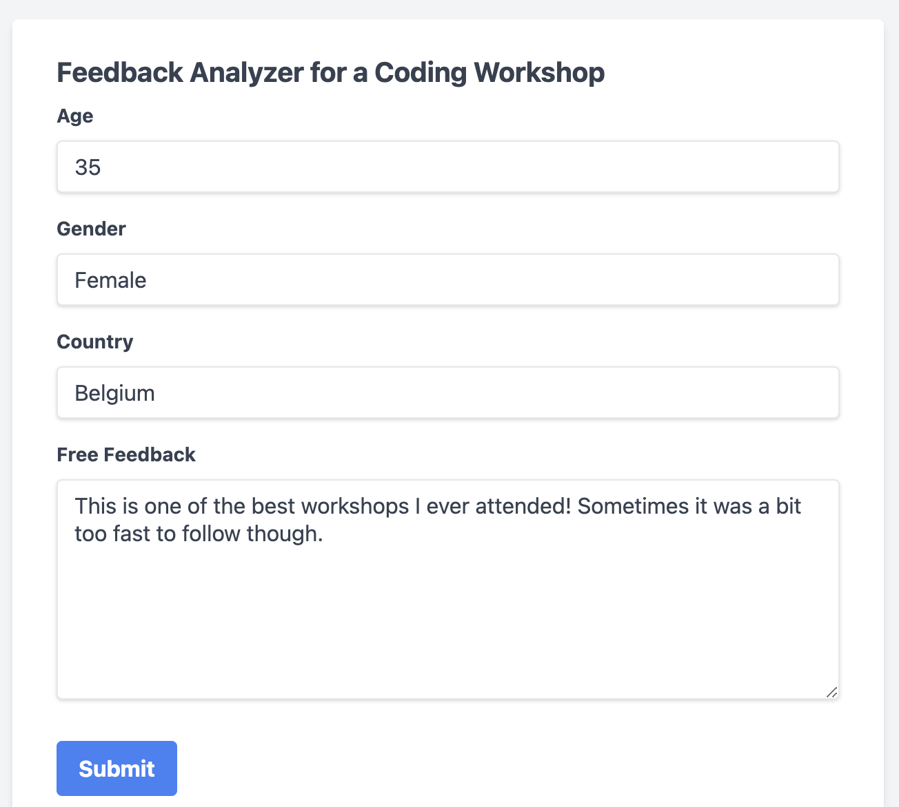
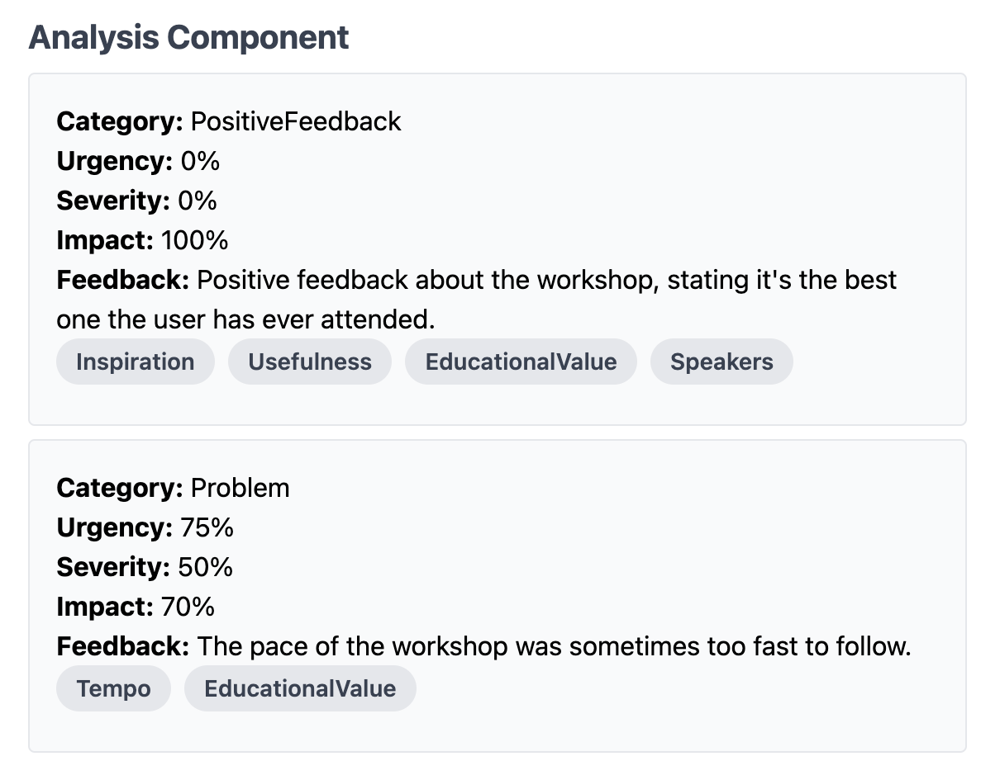
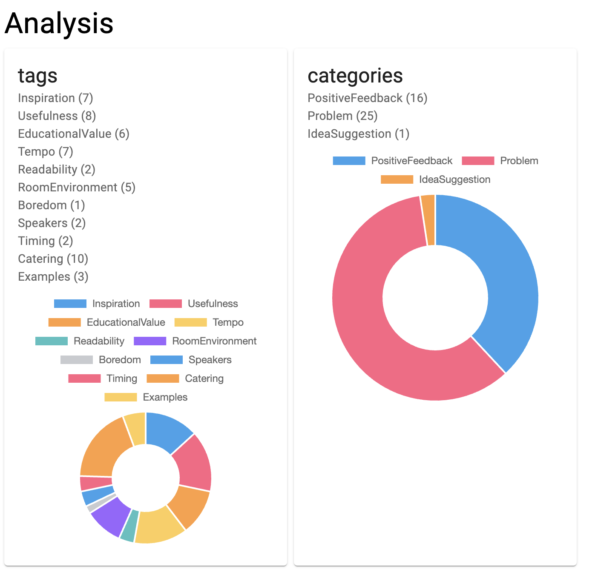
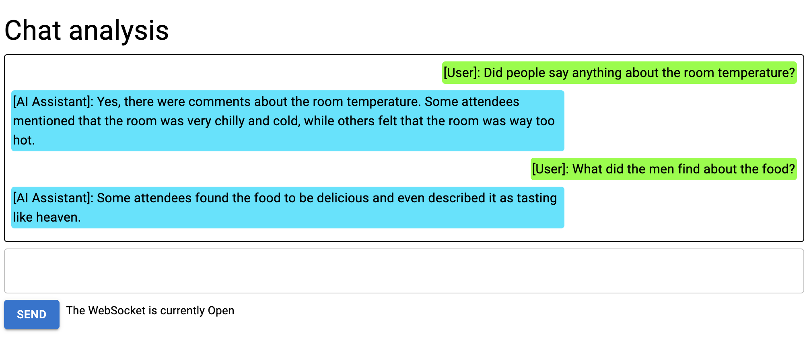

# Feedback Analyser Application


This application is meant to illustrate various LangChain4j building blocks and capabilities 
in a real application that also includes endpoints, frontend and databases. 
We wrapped the plain java code in a Quarkus web-application (for a fast and lightweight application), 
added a frontend (partly plain html, partly React) an SQLite database and provided Docker files for deployment.

You can concentrate on the business logic and use this project as a template for your own AI-powered projects.

These are some parts of the frontend






and this is the architecture of the application.


- [Project Setup](#project-setup)
    - [Prerequisites](#prerequisites)
    - [Setup](#setup)
    - [Running the Application](#running-the-application)
    - [Observing the result](#observing-the-result)
    - [Stopping the Application](#stopping-the-application)
    - [Development and hot loading](#development-and-hot-loading)
- [Goal of the Project](#goal-of-the-project)
- [Feedback Analyser Architecture and Classes](#feedback-analyser-architecture-and-classes)
    - [1. Feedback gathering and annotation](#1-feedback-gathering-and-annotation)
    - [2. Feedback corpus exploration with dashboard and chat assistant](#2-feedback-corpus-exploration-with-dashboard-and-chat-assistant)
- [Understanding the parts better](#understanding-the-parts-better)
    - [The AI Services](#the-ai-services)
    - [The Content Retriever for the Chatbot](#the-content-retriever-for-the-chatbot)
    - [The SQLite database](#the-sqlite-database)
    - [The Frontend](#the-frontend)
    - [The Endpoints](#the-endpoints)
- [Further Resources](#further-resources)


## Project Setup

```PlainText
Note: due to a pending bugfix we face some issues with the POJO parsing when entering feedback into the application.
This repo will get updated with a fix in the days to come.
```

### Prerequisites
To get this application running, you'll need
- Java 17 or higher
- Maven
- A key for the OpenAI API
- Docker (optional)

### Setup
- Store the OpenAI API key as environment variable `OPENAI_API_KEY` or register it in `application.properties`, and restart your IDE if needed
- The dependencies for quarkus and it's LangChain4j integration are already in the `pom.xml` file.

### Running the Application
To run the application, execute the following command in the project root:
```bash
mvn quarkus:dev
```
### Observing the result
Enter your feedback at `http://localhost:8080/feedback`

Observe the analysis and chat with the results at `http://localhost:8080/dashboard`

### Stopping the Application
To stop the application, press Ctrl+C in the terminal
Database entries will be persisted even when stopping and restarting the application, 
unless you specify otherwise in `application.properties`.

### Development and hot loading
Changes to the java code and html files will be hot-reloaded, so you can see the changes immediately in your browser.

You can access the Quarkus Dev Console at `http://localhost:8080/q/dev/` to see the status of the application, set parameters and inspect the logs.

```PlainText
DISCLAIMER:
We tried to stay as close to plain java as possible for the LangChain4j services, to allow all developers, 
regardless of their usual framework, to understand what’s happening after they worked through the basic tutorial.

If you are building a deviated product yourself, it is recommended to exploit the configuration and injection options 
offered by the framework of your choice (Quarkus or Spring Boot) to the maximum.
At some places in the code, pointers for proper Quarkus use are given in the comments.

This demo is a work in progress and is currently missing features like proper logging, good error handling, 
observability, unit tests and documentation. It will come :)
```

## Goal of the project
The goal of this example is to give you a feel of the versatility of LangChain4j capabilities in a real-world set-up.
What I hope you will take over for your own projects:
- A range of AiService usages (RAG-powered chat, splitter, analyser returning POJO)
- How to use LangChain4j with a front-end (endpoints and chatsocket)
- Persisting AI-processed data to both a classical database (SQLite) and an embedding store (InMemoryEmbeddingStore)
- Set-up of a webservice wrapper around plain LangChain4j code (Quarkus in this case, similar for Spring Boot) and it’s lifecycle aspects (StartupService, sessions, applicationScoped)
- Adapt our html to your use case
- Generating a Docker Image

What I hope you will do better:
- Add testing, proper error handling, logging and observability
- Exploit the configuration and injection capabilities of your framework better (LangChain4j has integrations with Quarkus or Spring Boot)
- Call your repo analyZer with a z...


## Feedback Analyser Architecture and Classes

The feedback analyser is intended to register feedback from users within a certain scope 
(in this case, a coding lab with around 60 users), to automatically tag and annotate it,
and in a second step to let organizers explore the feedback with a dashboard and a chat assistant.

The application consists of two distinct steps:
### 1. Feedback gathering and annotation
The users enter their feedback and a couple of additional fields at `/feedback.html`. 
They can put different complaints in one text field.


The form input gets sent to `/api/feedback` that
A) splits the original `UserFeedback` in pieces that are on one single topic, which we call `AtomicFeedback`
B) for each `AtomicFeedback` text, the model annotates it with a Category, Tags, and some measures like severity and urgency.


C) stores the `UserFeedback` and linked `AtomicFeedbacks` in an SQLite Database
D) calculates an embedding (semantic vector - see RAG pattern) for every `AtomicFeedback` text and stores is in an `InMemoryEmbeddingStore`

This image illustrates the two main data containers (POJOs) that we use


### 2. Feedback corpus exploration with dashboard and chat assistant
In a second step, the organizers can inspect all the feedback via
A) a dashboard that calls /api/dashboard which in its turn queries the SQLite Database, in order to visualise all the feedback


B) a chatbot that will give an informed answer because it will semantically search similar feedback parts to the user question.
It is currently configured to take at most the 10 most relevant pieces of feedback into account when answering.
On top of this, it will automatically filter on certain aspects of the metadata, such as gender.


## Understanding the parts better

### The AI Services

`FeedbackSplitterAIService.java` contains the AI Service interface for splitting the `UserFeedback` in coherent parts
`FeedbackAnalyserAIService.java` contains the instruction for analysing each small feedback part and annotate it with tags, severity, category, etc.
`FeedbackChatAIService.java` contains the AI Service for the chat assistant. It will be extended with memory, content retriever etc. as described below.

### The Content Retriever for the Chatbot
Each AtomicFeedback text get stored as vector + original segment in our `InMemoryEmbeddingStore`, 
together with some metadata of interest, such as gender, birthyear, tags, etc.

For retrieving relevant segments, we implemented a basis of naive RAG 
(= calculate the vector of the question and use the 10 best matching segments to help the LLM construct its answer).
We added a layer of metadata filtering on fields like birthyear and gender, 
and let the LLM take care of writing the appropriate filter for the questions.

The code handling the retriever and metadata filter can be found in `ChatSocket.java`.


### The SQLite database

We are setting up an SQLite database. This will allow us to store our database data in a file stored_feedback.db, 
within in our project. 
Stored_feedback.db is listed under .gitignore, 
so make sure to remove it from there if you would want to push your collected data to your repo.

In the normal cycle, upon application startup, the class StartupService.java 
will make sure the database tables are present by running create_tables.sql and create_tags.sql. 
If the database file is not yet there, it will be created in the folder resources/META-INF.resources. 
If the tables are already there, nothing will happen. That’s some of the conveniences of SQLite :)
You can inspect what’s in your database by opening stored_feedback.db and if needed, 
install an IDE plugin to have a proper look at the data in there.

If during development, you make changes to the schema, or if you want to wipe your data, 
you can use the property `app.database.reset` (default `false`) to force a run of `drop_tables.sql` 
before re-initializing the database. Don’t forget to set the property back to `false` afterwards.

If you want to load some demo data, use the property `app.database.prepopulate` (default `false`) 
to indicate that the file `populate_with_demo_data.sql` has to be run on startup. 
Don’t forget to set the property back to false afterwards.

When stopping the application (`Ctrl+C`), the database stays intact.

### The Frontend

The frontend consists html files under `src/main/resources/META-INF.resources`. 
The Quarkus framework will ensure these are served on `/filename.html`

There are two static html files (`feedback.html`,`dashboardwithchat.html`) 
and one React html file (`dashboard.html`) with it's scripts under `/assets`.

The static html files are built with `tailwind CSS` so it adapts to the screen width (reactivity). 
This static html should be easy to adapt for your own use case.

In `feedback.html` you’ll find an example of a webform content `POST` (JSON format), 
that will also handle the response of the backend and show it in the UI.
To see what this gives in the UI, run the application and go to `localhost:8080/feedback.html`


A part of the frontend (`dahsboard.html`) is in React, which is harder and rather unadaptable, 
but illustrates the possibilities better.


To give you a starting point for your own WebSocket handling on the frontend side (needed to build a chatbot), 
we left the example `dashboardwithchat.html` in (observe on `localhost:8080/dashboardwithchat.html`).

### The Endpoints
- `FeedbackController`: at `/api/feedback` receiving `UserFeedback` in JSON and returning analysed `AtomicFeedbacks` in JSON
- `DashboardController`: at `/api/dashboard` returning a JSON objects containing some statistics and all AtomicFeedbacks
- `ChatSocket`: websocket at `/api/chat` returning original user question + AI answer

## Further Resources
For a deeper dive, have a look at:
- [LangChain4j Documentation](https://github.com/langchain4j/langchain4j-examples/tree/main/tutorials/src/main/java)
- [Tutorials](https://github.com/langchain4j/langchain4j-examples/tree/main/tutorials/src/main/java)
- [Examples for all dependencies and frameworks integrating with LangChain4j](https://github.com/langchain4j/langchain4j-examples/tree/main/other-examples/src/main/java)
- [LangChain4j Repo](https://github.com/langchain4j/langchain4j) 
- TODO link to community examples
